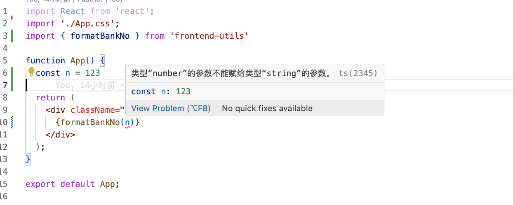

# 基础版

> 使用Rollup构建前端公共方法库，并打包推送至npm。

项目需要完成的有

1. 使用rollup构建，使用jest完成单元测试
2. node项目和前端项目均可以按需使用
3. 文档生成
4. 规范提交
5. 自动版本管理和生成CHANGELOG
6. 开发vscode插件，自动构建方法文件夹（方便开发人员开发）

## 使用Rollup.js完成基础版

### 配置rollup.config.js

首先是安装相关依赖。安装完后，配置rollup.config.js

针对三个不同的使用场景，打包输出三种模式，符合esmodule规范的esm.js；适用common.js的cjs.js；以及方便用于<script>标签形式引入的bundle.min.js

引入多个插件，用于导入数据，支持ts等。详情见代码

```javascript
const json = require('@rollup/plugin-json'); // 允许从json中导入数据
const typescript = require('@rollup/plugin-typescript'); // 支持ts
const resolve = require('@rollup/plugin-node-resolve'); // 便于引入第三方包
const commonjs = require('@rollup/plugin-commonjs'); // 处理commonjs
const terser = require('@rollup/plugin-terser'); // 压缩文件

const { name, version, author } = require('./package.json');

const banner =
  `${'/*!\n' + ' * '}${name}.js v${version}\n` +
  ` * (c) 2024-${new Date().getFullYear()} ${author}\n` +
  ` * Released under the MIT License.\n` +
  ` */`;

module.exports = {
  input: 'src/frontend-utils.ts',
  output: [
    // cjs and esm version
    {
      file: `dist/${name}.cjs.js`,
      format: 'cjs',
      banner: banner,
    },
    {
      file: `dist/${name}.esm.js`,
      format: 'es',
      banner,
    },
    // min.js
    {
      file: 'bundle.min.js',
      format: 'iife',
      name: 'version',
      plugins: [terser()],
    },
  ],
  plugins: [json(), resolve(), commonjs(), typescript({ module: 'ESNext' })],
};
```

### 文件目录与单元测试

1. 入口文件为frontend-utils.ts。文件内容为引入所需要的方法，并最终导出。每个方法维护在独立的文件夹中。文件夹内容包含，方法文件index.ts，方法文档README.md，方法单元测试文件夹。
2. 安装jest依赖，配置jest.config.js

#### 项目目录


#### 代码

```typescript
// 项目入口文件
import formatBankNo from './formatBankNo'; // 引入方法
const frontendUtils = {
  formatBankNo,
};
export default frontendUtils;
export { formatBankNo };
```

```typescript
// 单元测试代码
import formatBankNo from '../index';

describe('validate:', () => {
  describe('formatBankNo 验证', () => {
    test('123412341234123', () => {
      expect(formatBankNo('123412341234123')).toBe('1234 1234 1234 123');
    });
  });
});
```

### 配置package.json

```json
{
  "name": "frontend-utils",
  "description": "使用rollup构建前端公共方法库",
  "version": "0.0.1",
  "main": "dist/frontend-utils.esm.js", // 主要输出
  "commonjs": "dist/frontend-utils.cjs.js",
  "browser": "dist/frontend-utils.min.js",
  "typings": "./dist/frontend-utils.d.ts", // 声明文件
  "dependencies": {
    "fsevents": "^2.3.3"
  },
  "scripts": {
    "test": "jest", // 跑单测
    "build": "rollup -c",
    "clean": "rimraf dist"
  },
  "author": "PanYouFu",
  "license": "ISC",
  "devDependencies": {
    "@rollup/plugin-commonjs": "^25.0.7",
    "@rollup/plugin-json": "^6.1.0",
    "@rollup/plugin-node-resolve": "^15.2.3",
    "@rollup/plugin-terser": "^0.4.4",
    "@rollup/plugin-typescript": "^11.1.6",
    "@types/jest": "^29.5.12",
    "@typescript-eslint/parser": "^7.8.0",
    "eslint": "^8.5.0",
    "jest": "^29.7.0",
    "prettier": "^3.2.5",
    "rollup": "^4.17.2",
    "tslib": "^2.6.2"
  },
  "files": [
    // npm包中实际内容
    "dist",
    "README.md",
    "CHANGELOG.md",
    "package.json"
  ]
}
```

### 基础功能测试

此时我们已经，有了项目的一些基本功能。尝试构建，并在项目中使用

1. 输入 npm run build得到dist文件夹内容如下

   

2. 新建react项目。在其nodemodules中新建frontend-utils文件夹，将我们方法库项目中的dist package.json 和 readme.md 赋值到这里。

3. 在代码中引用，检测是否正确。可正常使用，且有ts检验提示

   

# 改进

> 虽然基础版已经有了，但我们还有以下需求需要完善：
>
> 1. 完善ts注释与文档生成
> 2. lint校验与规范提交
> 3. 版本管理和生成CHANGELOG
> 4. 开发vscode插件，自动编写基础代码

## 1. 完善ts注释与文档生成

### 完善方法注释

使用TSDoc规范，为项目方法添加注释

实例：

````typescript
/**
 * 银行卡号格式化 4位一分隔
 *
 * @param bankNo string
 * @returns 格式化后的银行号号
 */
function formatBankNo(bankNo: string): string {
  ...
}

export default formatBankNo;

/**
 * @param
 *  date - 时间戳
 *  type - 返回参数格式
 * @returns
 *  YYYY年MM月DD日（默认）
 *  YYYY/MM/DD
 *  YYYY-MM-DD
 *  YYYY年M月D日
 *  YYYY/M/D
 *  YYYY-M-D
 * @example
 * ```js
 * import { formatDate } from 'frontend-utils'
 * const dateStamp = new Date().getTime()
 * const date = formatDate(dateStamp)
 * ```
 *
 * @remarks
 * 默认返回YYYY年MM月DD天格式
 *
 * @beta
 */
function formatDate(dateStamp: number, type?: string): string {
  ...
}

function getzf(num: number) {
  let str = num.toString();
  if (num < 10) {
    str = '0' + str;
  }
  return str;
}

export default formatDate;
````

使用示范：


### 基于注释生成文档

我们当前已经安装TSDoc规范写好了，方法的注释，以及案例。我们可以基于此，生成使用文档。好消息，有现成的工具可以使用。

@microsoft/api-extractor 和 @microsoft/api-documenter

API Extractor 能够生成一份json格式的文档模型（api-model）。相关配置在配置文件的 docModel字段。使用 @microsoft/api-documenter 生成 Markdown 文档

#### 配置

##### api-extractor.json

```json
// 这列举重要参数
{
  // 入口文件最重要
  "mainEntryPointFilePath": "<projectFolder>/dist/frontend-utils.d.ts",
  // 生成文档模型文件 (*.api.json) 后续文档基于这个json文件生成。
  "docModel": {
    "enabled": true
  },
  // 用于生成统一的声明文件，作用是将上一步中子文件夹中的声明内容，转移到新的声明文件中
  "dtsRollup": {
    "enabled": true,
    "untrimmedFilePath": "<projectFolder>/dist/frontend-utils.d.ts"
  }
}
```

##### api-documenter.json

```json
{
  "$schema": "https://developer.microsoft.com/json-schemas/api-documenter/api-documenter.schema.json",
  "entryPoint": "./src/frontend-utils.ts",
  "projectFolder": "./src",
  "mainEntryPointFilePath": "<projectFolder>/dist/frontend-utils.d.ts"
}
```

##### package.json

```json
// 修改scripts
{
  ...
  "scripts": {
    "test": "jest",
    "build": "npm run clean && rollup -c && api-extractor run --local --verbose", // 删除上一次输出，打包，生成新声明文件
    "clean": "rimraf dist",
    "doc:generate": "api-documenter markdown -i temp -o doc" // 根据注释生成文档
  },
  ...
  "files": [
    "dist",
    "doc", // 增加文档导出
    "README.md",
    "package.json"
  ]
}
```

### 效果


## 2. lint校验与规范提交

首先安装lint相关依赖，并配置json，这个参考的有很多。我们直接看下如何规范提交。

### 规范提交

规范提交我们需要做到以下几件事：

1. 提交校验需要通过 lint校验，jest单测通过。
2. 需确定提交规范，明确每次是做了哪些修改，是新增功能还是改bug。

我们可以选择

1. 使用Husky 添加hooks在提交前对代码进行校验。
2. 使用 git-cz 来规范提交

#### 安装与配置Husky

```
npm install husky --save-dev
```

```json
// package.json
{
  ...
  "scripts": {
    "prepare": "husky install"
  },
  ...
  "lint-staged": {
    "*.{ts,js}": [
      "eslint --fix"
    ]
  },
  // *.{.ts,.js} 匹配所有以 .ts 或 .js 结尾的文件, 对匹配到的文件运行 ESLint 来进行代码检查和修复 被 ESLint 修改过的文件重新添加到 Git 的暂存区
}
```

需在.hsuky文件夹下新增pre-commit文件

```
#!/bin/sh
. "$(dirname "$0")/_/husky.sh"
npx lint-staged && npx jest -u
```

#### 安装与配置git-cz

```bash
npm install commitizen --save-dev
npm install cz-conventional-changelog --save-dev
```

```json
// package.json
{
  ...
  "config": {
    "commitizen": {
      "path": "cz-conventional-changelog" // 一个适配器（adapter）为 commitizen 所使用，它帮助自动化并标准化 Git 提交信息的格式
    }
  },
}
```

Conventional Changelog 提倡使用一组预先定义的提交消息规范，以方便自动化处理。这些规范通常包括：

- **feat**：添加新功能（feature）。
- **fix**：修复 bug。
- **docs**：仅文档更改。
- **style**：不影响代码含义的更改（空格、格式化、缺少分号等）。
- **refactor**：既不修复错误也不添加功能的代码更改。
- **perf**：改善性能的代码更改。
- **test**：添加缺失测试或更正现有测试。
- **chore**：对构建过程或辅助工具和库（如文档生成）的更改。

#### 使用效果


## 3. 版本管理

使用standard-version

```bash
npm install standard-version --save-dev
```

```json
{
  "scripts": {
    "release": "standard-version",
    "release-major": "standard-version -r major", // Major（主版本号）
    "release-minor": "standard-version -r minor", // Minor（次版本号）
    "release-patch": "standard-version -r patch" // Patch（修订号）
  }
}
```

#### 效果

执行命令会生成CHANGELOG.md


## 4. 发布

首先需要npm账号~

### 一、登录账号

```bash
npm login // 记得改下源
```

### 二、配置 prepublishOnly

- `npm run lint:fix`：执行 lint 并自动修复可能的代码问题。
- `npm run test`：运行测试，确保所有功能正常。
- `npm run build`：构建项目。
- `npm run doc:generate`：生成项目文档。

```json
// package.json
{
	...
	"scripts": {
		"prepublishOnly": "npm run lint:fix && npm run test && npm run build && npm run doc:generate"
	}
	...
}
```

### 三、发布

```bash
npm publish // 发布到 npm 的私有仓库或组织，需要添加 --access public 或 --access restricted
```

哦豁，报错，照着改一下咯


成了


### 验证

此时在npm上已经可以看到我们的包了。


在我们的react项目中使用验证一下

```bash
npm i youfu-frontend-utils
```

```react
import React from 'react';
import { formatBankNo } from 'youfu-frontend-utils';
import './App.css';

function App() {
  const bankNo = formatBankNo('123412341234123')

  return (
    <div className="App">
      bankNo: {bankNo}
    </div>
  );
}

export default App;
```

# 完善

### 插件开发
